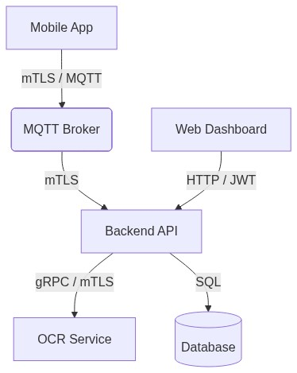
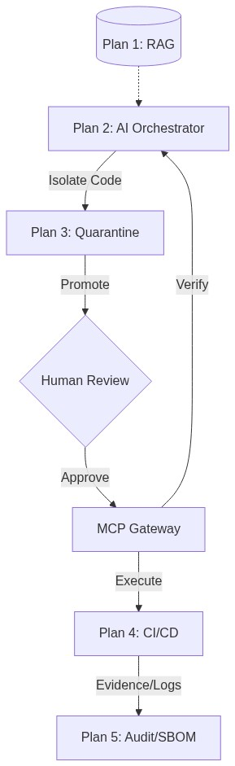

# Fetitele Powerpuff: Secure Medical Streaming & Analytics


## 🛡️ Project Overview

**Fetitele Powerpuff** (Secure Systems Project) is a sophisticated, end-to-end secure system designed for the capture, transmission, and intelligent analysis of medical documentation. Built with a "Security-First" philosophy, it leverages **mTLS (Mutual TLS)** and **JWT** to ensure the integrity and confidentiality of sensitive medical data as it flows from edge devices to a centralized analytics dashboard.

The system is uniquely equipped with an **AI Governance engine** that audits architectural compliance and a dedicated **gRPC OCR service** optimized for medical documents in both English and Romanian.

---

## ✨ Key Features

### 🔐 Multi-Layered Security
- **mTLS Communication:** All device-to-server (MQTT) and service-to-service (gRPC) communication is encrypted and authenticated via Mutual TLS.
- **JWT Authentication:** Secure user and device registration with JSON Web Token-based access control.
- **RBAC Zones:** Granular Role-Based Access Control enforced at both the application and AI governance layers.

### 📸 Intelligent Image Pipeline
- **Distributed Capture:** Supports medical image ingestion from Android mobile applications.
- **Live Streaming:** Real-time "Live Mode" for continuous monitoring or single-shot "Normal Mode" capture.
- **Advanced OCR Engine:** A dedicated Go-based service using Tesseract to extract medical insights with multi-language support (English/Romanian).

### 📊 Data Analytics & Dashboard
- **Medical Insights:** Automatic classification of medical opinions (APT, Inapt, etc.) and control types (Periodic, Employment, etc.).
- **Full-Text Search:** Search through vast medical records using the text extracted via OCR.
- **Interactive Visualizations:** Real-time charts and statistics for medical data distribution.

### 🤖 AI Governance & Auditing
- **CrewAI Orchestration:** Autonomous agents manage architectural guidelines and project workflows.
- **Immutable Audit Logs:** Every action taken by the AI system is recorded in a secure, local audit trail for transparency and accountability.
- **Architectural Guardrails:** Automated enforcement of project-wide development standards.

---

## 🏗️ System Architecture

The project follows a microservices-inspired architecture containerized with Docker, partitioned into a core application flow and an automated AI governance pipeline.

### 📱 Primary Application Flow


### 🤖 AI Governance & Secure Pipeline (The 5-Plan Strategy)


---

## 💻 Technology Stack

| Layer | Technologies |
|---|---|
| **Frontend** | React, TypeScript, Vite, TailwindCSS, Chart.js |
| **Backend** | Go (Golang), GORM, Paho MQTT |
| **OCR Service** | Go, gRPC, Tesseract (Gosseract) |
| **Mobile** | Android (Kotlin/Java) |
| **AI/Orchestration** | Python, CrewAI, GitPython |
| **Infrastructure** | Docker Compose, Mosquitto MQTT, PostgreSQL |

---

<!-- SBOM:START -->
## SBOM Snapshot

This section is auto-generated during build by web/scripts/dev-start.sh.

Last updated: 2026-05-23 16:48:08 UTC

### Go Backend Server

Source: web/server/go.mod

Total dependencies: 63

| Dependency | Version |
|---|---|
| cel.dev/expr | v0.25.1 |
| cloud.google.com/go/compute/metadata | v0.9.0 |
| github.com/cespare/xxhash/v2 | v2.3.0 |
| github.com/cncf/xds/go | v0.0.0-20260202195803-dba9d589def2 |
| github.com/davecgh/go-spew | v1.1.1 |
| github.com/eclipse/paho.mqtt.golang | v1.5.1 |
| github.com/envoyproxy/go-control-plane/envoy | v1.37.0 |
| github.com/envoyproxy/go-control-plane/ratelimit | v0.1.0 |
| github.com/envoyproxy/go-control-plane | v0.14.0 |
| github.com/envoyproxy/protoc-gen-validate | v1.3.3 |
| github.com/go-jose/go-jose/v4 | v4.1.4 |
| github.com/golang/glog | v1.2.5 |
| github.com/golang-jwt/jwt/v4 | v4.5.2 |
| github.com/golang/protobuf | v1.5.4 |
| github.com/go-logr/logr | v1.4.3 |
| github.com/go-logr/stdr | v1.2.2 |
| github.com/GoogleCloudPlatform/opentelemetry-operations-go/detectors/gcp | v1.31.0 |
| github.com/google/go-cmp | v0.7.0 |
| github.com/google/uuid | v1.6.0 |
| github.com/gorilla/websocket | v1.5.3 |
| github.com/jackc/pgpassfile | v1.0.0 |
| github.com/jackc/pgservicefile | v0.0.0-20240606120523-5a60cdf6a761 |
| github.com/jackc/pgx/v5 | v5.9.2 |
| github.com/jackc/puddle/v2 | v2.2.2 |
| github.com/jinzhu/inflection | v1.0.0 |
| github.com/jinzhu/now | v1.1.5 |
| github.com/kr/pretty | v0.3.0 |
| github.com/mattn/go-sqlite3 | v1.14.22 |
| github.com/otiai10/gosseract/v2 | v2.4.1 |
| github.com/otiai10/mint | v1.6.3 |
| github.com/planetscale/vtprotobuf | v0.6.1-0.20240319094008-0393e58bdf10 |
| github.com/pmezard/go-difflib | v1.0.0 |
| github.com/spiffe/go-spiffe/v2 | v2.6.0 |
| github.com/stretchr/objx | v0.1.0 |
| github.com/stretchr/testify | v1.11.1 |
| github.com/yuin/goldmark | v1.4.13 |
| golang.org/x/crypto | v0.48.0 |
| golang.org/x/mod | v0.32.0 |
| golang.org/x/net | v0.51.0 |
| golang.org/x/oauth2 | v0.36.0 |
| golang.org/x/sync | v0.20.0 |
| golang.org/x/sys | v0.42.0 |
| golang.org/x/term | v0.40.0 |
| golang.org/x/text | v0.34.0 |
| golang.org/x/tools | v0.41.0 |
| gonum.org/v1/gonum | v0.17.0 |
| google.golang.org/genproto/googleapis/api | v0.0.0-20260226221140-a57be14db171 |
| google.golang.org/genproto/googleapis/rpc | v0.0.0-20260226221140-a57be14db171 |
| google.golang.org/grpc | v1.81.1 |
| google.golang.org/protobuf | v1.36.11 |
| go.opentelemetry.io/auto/sdk | v1.2.1 |
| go.opentelemetry.io/contrib/detectors/gcp | v1.42.0 |
| go.opentelemetry.io/otel/metric | v1.43.0 |
| go.opentelemetry.io/otel/sdk/metric | v1.43.0 |
| go.opentelemetry.io/otel/sdk | v1.43.0 |
| go.opentelemetry.io/otel/trace | v1.43.0 |
| go.opentelemetry.io/otel | v1.43.0 |
| gopkg.in/check.v1 | v1.0.0-20201130134442-10cb98267c6c |
| gopkg.in/yaml.v3 | v3.0.1 |
| gorm.io/driver/postgres | v1.6.0 |
| gorm.io/driver/sqlite | v1.6.0 |
| gorm.io/gorm | v1.31.1 |
| go.uber.org/mock | v0.5.2 |

### OCR Service

Source: web/ocr-service/go.mod

Total dependencies: 41

| Dependency | Version |
|---|---|
| cel.dev/expr | v0.25.1 |
| cloud.google.com/go/compute/metadata | v0.9.0 |
| github.com/cespare/xxhash/v2 | v2.3.0 |
| github.com/cncf/xds/go | v0.0.0-20260202195803-dba9d589def2 |
| github.com/envoyproxy/go-control-plane/envoy | v1.37.0 |
| github.com/envoyproxy/go-control-plane/ratelimit | v0.1.0 |
| github.com/envoyproxy/go-control-plane | v0.14.0 |
| github.com/envoyproxy/protoc-gen-validate | v1.3.3 |
| github.com/go-jose/go-jose/v4 | v4.1.4 |
| github.com/golang/glog | v1.2.5 |
| github.com/golang/protobuf | v1.5.4 |
| github.com/go-logr/logr | v1.4.3 |
| github.com/go-logr/stdr | v1.2.2 |
| github.com/GoogleCloudPlatform/opentelemetry-operations-go/detectors/gcp | v1.31.0 |
| github.com/google/go-cmp | v0.7.0 |
| github.com/google/uuid | v1.6.0 |
| github.com/otiai10/gosseract/v2 | v2.4.1 |
| github.com/otiai10/mint | v1.6.3 |
| github.com/planetscale/vtprotobuf | v0.6.1-0.20240319094008-0393e58bdf10 |
| github.com/spiffe/go-spiffe/v2 | v2.6.0 |
| golang.org/x/crypto | v0.48.0 |
| golang.org/x/mod | v0.32.0 |
| golang.org/x/net | v0.51.0 |
| golang.org/x/oauth2 | v0.36.0 |
| golang.org/x/sync | v0.20.0 |
| golang.org/x/sys | v0.42.0 |
| golang.org/x/term | v0.40.0 |
| golang.org/x/text | v0.34.0 |
| golang.org/x/tools | v0.41.0 |
| gonum.org/v1/gonum | v0.17.0 |
| google.golang.org/genproto/googleapis/api | v0.0.0-20260226221140-a57be14db171 |
| google.golang.org/genproto/googleapis/rpc | v0.0.0-20260226221140-a57be14db171 |
| google.golang.org/grpc | v1.81.1 |
| google.golang.org/protobuf | v1.36.11 |
| go.opentelemetry.io/auto/sdk | v1.2.1 |
| go.opentelemetry.io/contrib/detectors/gcp | v1.42.0 |
| go.opentelemetry.io/otel/metric | v1.43.0 |
| go.opentelemetry.io/otel/sdk/metric | v1.43.0 |
| go.opentelemetry.io/otel/sdk | v1.43.0 |
| go.opentelemetry.io/otel/trace | v1.43.0 |
| go.opentelemetry.io/otel | v1.43.0 |

<!-- SBOM:END -->

---

## 🚀 Getting Started

### Prerequisites
- **Docker & Docker Compose**
- **Node.js** (v24+ recommended)
- **Python** (3.10+ for AI Governance)
- **Android Studio** (for mobile development)

### Quick Start (Development Mode)
1. **Clone the repository:**
   ```bash
   git clone https://github.com/your-org/ss-project.git
   cd ss-project/web
   ```

2. **Generate Security Certificates:**
   ```bash
   ./scripts/gen-ca.sh
   ./scripts/gen-android-stores.sh
   ```

3. **Launch the Stack:**
   ```bash
   ./start.sh
   ```
   *This script installs dependencies, starts Docker containers (API, DB, MQTT, OCR), and launches the Vite dev server.*

4. **Access the Dashboard:**
   Navigate to `http://localhost:5173`. Use the default credentials or register a new account.

---

## 🛡️ AI Governance & Ethics

The `ai-governance/` module is a core component of the project. It ensures that any AI-driven modifications or analyses adhere to strict safety and architectural standards:
- **Zone Control:** Restricts file system access based on predefined "Red Zones" (secrets, logs) and "Developer Zones" (src, web).
- **Accountability:** Every agent thought process and tool invocation is logged to `ai-governance/audit.log`.
- **Integrity:** Prevents unauthorized writes to sensitive configuration files.

---

## 📄 License

This project is developed for the **Security of Systems** course. All rights reserved.

---

*Built with ❤️ by the **Fetitele Powerpuff** Team.*
